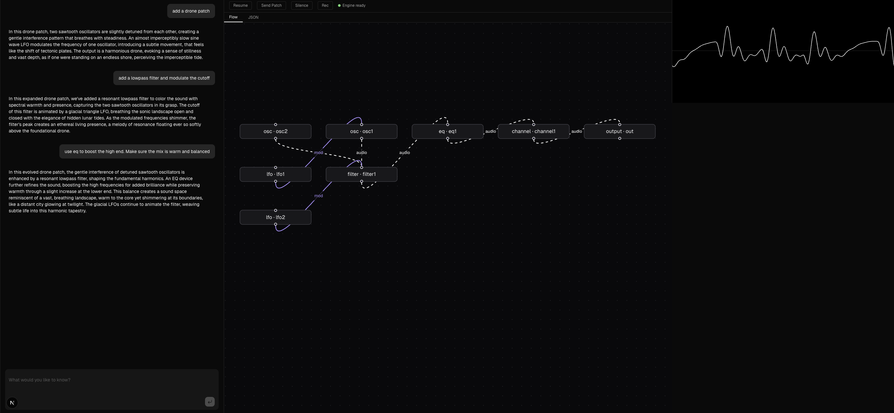

## 🎛️ AI Modular Synth Patch Generator

An agentic AI application that enables natural language interaction for creating modular synthesizer patches.

Built with **LangChain/LangGraph** and **React/Next.js**, the system leverages **Web Audio API**, **AudioWorklets**, and **Faust** (compiled to WebAssembly) to power a flexible, high-performance audio engine directly in the browser.

You can chat with an LLM that understands both the technical and artistic aspects of modular synthesis. It designs complete patch structures, connects modules, and shapes sound with intention.

Beyond patch creation, the LLM also applies **professional mixing practices**, including EQ, gain staging, and tonal balancing—ensuring that generated sounds are not only functional but sonically refined.

---

If you want, I can turn this into a full GitHub README with diagrams and architecture explanation.
